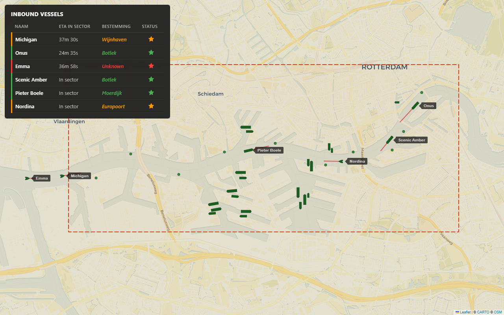
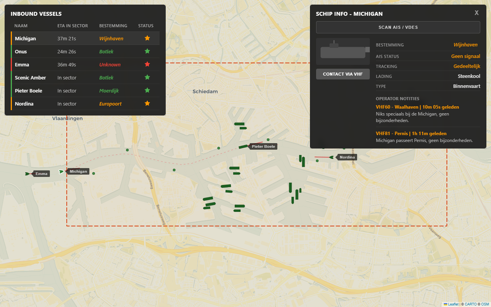
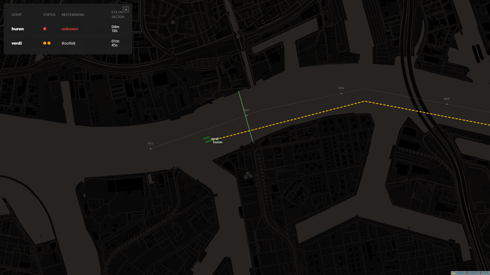

# VTS MVP - Digitale VTS Overlay

Een digitale weergave van een VTS-overlay (Vessel Traffic Services) voor het Rotterdamse havengebied. De applicatie toont schepen op een interactieve kaart, hun koers, bestemming en verificatiestatus. Gebouwd als technisch prototype (MVP) voor het onderzoeksproject "Slimme Objecten".

> Deze repository bevat de **frontend**. De backend (FastAPI + Postgres) is uitgesplitst naar [`vts-intentions-api`](https://github.com/CMIIDP-Sem6C/vts-intentions-api).

## Screenshots







## Vereisten

- [Node.js](https://nodejs.org/) v18 of hoger
- De API uit [`vts-intentions-api`](https://github.com/CMIIDP-Sem6C/vts-intentions-api) draaiend op `localhost:3001` (zie installatie-instructies in die repo)

## Installatie

```bash
npm install
```

## Starten

In **terminal 1** — clone en start de API uit de aparte repo (eenmalig setup, daarna alleen starten):

```bash
# Eenmalig:
git clone https://github.com/CMIIDP-Sem6C/vts-intentions-api.git
cd vts-intentions-api
pip install -r requirements-api.txt
# Maak .env op basis van .env.example

# Elke sessie:
python -m api.main
```

In **terminal 2** — de frontend:

```bash
node ./node_modules/vite/bin/vite.js
```

Open vervolgens [http://localhost:5173](http://localhost:5173) in je browser.

> **Let op:** `npm run dev` kan problemen geven als het mappad speciale tekens bevat (zoals `&`). Gebruik in dat geval bovenstaand commando.

De Vite-proxy (zie `vite.config.js`) stuurt alle `/api/*`-requests automatisch door naar `localhost:3001`, dus de frontend hoeft niets te weten over de API-locatie tijdens development.

## Bouwen voor productie

```bash
node ./node_modules/vite/bin/vite.js build
```

De gebouwde bestanden staan dan in de `dist/` map.

## Projectstructuur

```
src/
  components/
    ScenarioSelect.jsx    Startup overlay: kies een scenario uit de DB
    SectorSelect.jsx      Vervolg overlay: kies VTS-sector (Eemhaven / Waalhaven)
    map/
      VTSMap.jsx          Leaflet kaart met sector-overlay, ships en intention-lines
      ShipMarker.jsx      Triangle + hull scheepsiconen met richtingsvector op hover
    panels/
      InboundPanel.jsx    Lijst inkomende schepen met status kleuren (rood/geel/groen) + minimize
      ShipInfoCard.jsx    Detail-panel met editable bestemming en AIS scan functie
      Flag.jsx            Vlaggen voor scheepsnationaliteit
    inputs/
      TextAutocompleteInput.jsx
    layout/
      AppLayout.jsx       Fullscreen layout met overlay-panels
  data/
    sectors.js            Sectorgrenzen Nieuwe Maas (Eemhaven / Waalhaven), centerline, km-markers
  hooks/
    useScenarioData.js          Haalt scenario bundle (ships, intentions, events) op
    useScenarioSimulation.js    Driver: spawnt schepen op trigger_time, beweegt ze langs DB-route, regelt intentie zichtbaarheid (HideIntention/ShowIntention)
    useVerificationSync.js      Polling sync voor verificaties met de API
  utils/
    navigation.js         Haversine, heading, ETA berekeningen
    status.jsx            Status-logica (groen/oranje/rood) gedeeld tussen marker, info-card en inbound-panel
  App.jsx                 Hoofdcomponent met scenario- en sector-selectie state
  App.css                 Tidalis-stijl donker VTS-thema
docs/
  vts-overview.png, vts-ship-info.png, vts-scenario-uitwijken.png
mock/
  api/destinations/       Statische mock-data (alleen voor frontend, los van de API repo)
```

## Tech Stack

- **React 18** (JavaScript)
- **Vite** (bundler, met proxy naar de API)
- **Leaflet** + **react-leaflet** (kaart)
- **Puppeteer** (screenshots)
- Waypoint-coordinaten gebaseerd op **OpenStreetMap** data (Nieuwe Maas centreline)

Voor de API-stack (FastAPI / asyncpg / Postgres) zie [`vts-intentions-api`](https://github.com/CMIIDP-Sem6C/vts-intentions-api).

## Functionaliteiten

- Scenario-selector als startscherm: scenario's komen uit de database via de API (`/api/scenarios`)
- Sector-selector na scenario-keuze: kies VTS-sector Eemhaven of Waalhaven (Rotterdam, Nieuwe Maas)
- Database-gedreven scheepssimulatie: ships spawnen op `trigger_time` events, volgen `route` waypoints uit de DB
- Intentie-lijnen (declared route) per ship, dynamisch in/uit te schakelen via `HideIntention` / `ShowIntention` events
- Waarschuwingspaneel bovenaan bij `AlertIntentionChange` events (8 seconden zichtbaar, scheepsnaam uit `subject_id`)
- Reeds-gevaren deel van de intentie-lijn wordt automatisch afgesneden voorbij de huidige scheepspositie
- Twee typen scheepsmarkers: driehoekige pijltjes (klein/snel) en langwerpige vrachtschepen
- Status-kleur als omtrek rond elke scheepsmarker (groen/oranje/rood) gesynchroniseerd met de info-card en het inbound-panel
- Korte rode richtingsvector op hover voor elk schip
- Inbound vessel panel met ETA naar sector-grens, filtert op actieve sector, minimaliseerbaar voor screenshots
- VTS operator kan bestemming invoeren en AIS status scannen via het detail-panel
- Tidalis-gebaseerde visuele stijl met warm kleurfilter
